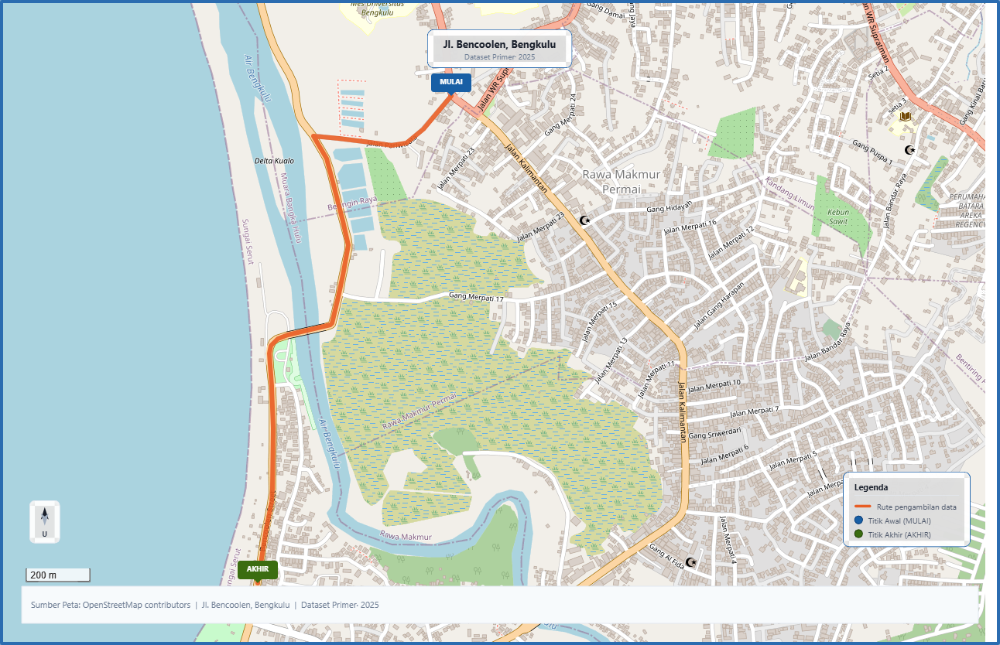

# Bengkulu Nighttime Pothole Dataset (BNPD) - Test Set

This primary dataset contains a collection of pothole images specifically captured in nighttime scenarios. This dataset is designed exclusively as a test set for performance evaluation and to test object detection models, especially the YOLO architecture.

## 📍 Data Acquisition

Data collection focused on local roads in Bengkulu Province, specifically along a 2 km stretch of Jl. Bencoolen. 



This road segment was chosen based on the presence of 18 potholes that are representative as test sample objects with varying nighttime lighting characteristics, ranging from well-lit areas under street lights to completely dark areas.

The nighttime image capture process was carried out from a front-facing perspective using a camera mounted on a tripod at a height of 145 cm to simulate an ideal vehicle viewpoint.

Furthermore, to obtain the actual dimensions of the potholes as validation references (ground truth), overhead images of each pothole were taken using a reference object measuring 21.0 cm x 14.85 cm to ensure accurate calculation of pixel-to-real-world size conversion scales.

## 📊 Dataset Specifications

* **Data Role:** Test Set
* **Image Format:** `.jpg` / `.png`
* **Annotation Format:** YOLO format (`.txt`) containing bounding box coordinates
* **Total Classes:** 1 class (`pothole`)

## 📄 Metadata & Physical Validation

This dataset includes two supplementary CSV files containing information on physical dimensions and perspective transformation coordinates for advanced validation purposes:

1. **`validation_gt.csv`**
   This file stores ground truth data on the actual dimensions of potholes as a reference for true accuracy levels.
   * **Columns:** `real_id, real_image, pothole_idx_in_image, pothole_id, gt_w_cm, gt_h_cm, gt_area_cm2`

2. **`src_pts.csv`**
   This file contains source point coordinates for Bird’s Eye View (BEV) transformation calculations in millimeter units.
   * **Columns:** `image, tl_x, tl_y, tr_x, tr_y, br_x, br_y, bl_x, bl_y, real_width_mm, real_depth_mm, bev_w, bev_h`

## 📁 Directory Structure

Because it is intended specifically as test data, the directory structure is simplified as follows:

```text
Bengkulu-Nighttime-Pothole-Dataset/
│
├── images/
├── labels/
├── validation_gt.csv
└── src_pts.csv

```

## 📜 License & Citation


## License
This dataset is licensed under [CC BY 4.0](https://creativecommons.org/licenses/by/4.0/).

*(Note: The formal citation block will be updated here once the manuscript is officially published).*
